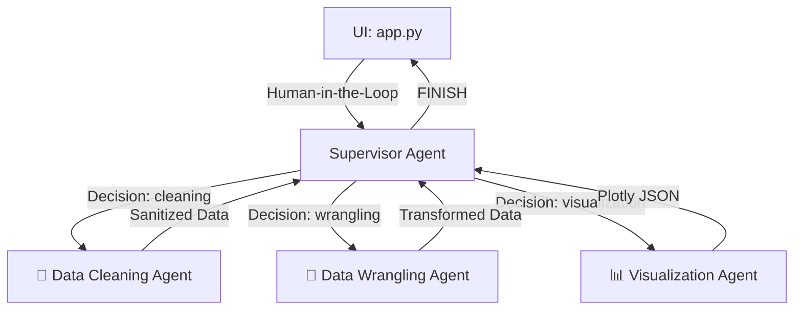

  
  
  
  <h1>🧠 Project Memory & Architecture Map</h1>

> **Summary**: This file serves as the core knowledge base and execution guideline for the **EDA Agents** project. It tracks the system's architecture, tools, environment guidelines, and recent history. Keep it strictly updated.

---

### 🚨 Critical Directives
| Type | Directive | Command / Note |
| :--- | :--- | :--- |
| 🛠️ **Env** | **ALWAYS** activate virtual env before commands | `source eda/bin/activate` |
| 📂 **Path** | Operate strictly within project root | `/Users/akashsmu/Desktop/EDA_Agents` |
| 🚀 **Run** | Launch Streamlit web interface | `streamlit run src/eda_agents/ui/app.py` |
| 🧪 **Test** | Execute Pytest suite | `pytest tests/` |
| 📦 **Pkg** | Do NOT use Poetry for changes | Use standard `pip` only. |

---

### 🏗️ System Architecture

<b>View Component Diagram</b>

- **Orchestration**: `SupervisorAgent` uses `LangGraph` and `StateGraph` for cyclic task routing and HITL pausing.
- **Factory Pattern**: Core agents inherit from `BaseAgent` and use standard state schemas.
- **State Checkpointing**: Uses `MemorySaver` thread persistence for undo/redo data timelines.

---

### 📜 Execution History (Latest First)

<h4>🔥 Current Iteration: Agent Reliability & Dashboards</h4>
<ul>
  <li><b>Supervisor Logic:</b> Rebuilt <code>app.py</code> and <code>supervisor.py</code> to fix LangGraph state accumulation, properly injecting <code>RunnableConfig</code> and dynamically resetting thread caching for new user requests.</li>
  <li><b>Data Integrity:</b> Eradicated mixed-type <code>PyArrow</code> Streamlit crashes by adding strict object sanitization.</li>
  <li><b>Code Generation:</b> Injected strong Few-Shot Prompting to workers so Pandas code utilizes correct variable reassignment (<code>inplace=True</code>), successfully fixing execution drops.</li>
  <li><b>UI Enhancements:</b> Upgraded to a <b>Glassmorphic Dashboard</b> with Dataset Health Checks, automated outlier/imputation Action Cards, data previews, and an animated State Timeline.</li>
</ul>

<b>Archive: Iterations 0 - 10</b>

 

* **UI Flow & Visuals**: Upgraded the Missing Value & Feature Distributions tab with interactive Plotly visualizations. Fixed Streamlit duplicate ID crashes. Added the dynamic Agent Flowchart thinking process box to chat.
* **Refactoring & Setup**: Fully transitioned from isolated agents to the Multi-Agent Supervisor system. Created factory patterns for `DataCleaningAgent`, `DataWranglingAgent`, and `DataVisualizationAgent`.
* **Testing & Infrastructure**: Integrated Docker and Compose (`Dockerfile`, `docker-compose.yml`). Decoupled PyTest suite from live OpenAI keys via MagicMock.

---

### 📋 Living Task Tracker
*This tracker defines the immediate focus and prevents regression.*

- [x] **Agent Routing**: Prevent supervisor "completed" hallucination.
- [x] **State Persistence**: Enable UNDO/REDO data manipulation snapshots in sidebar.
- [x] **UI Polish**: Convert plain UI into a highly visual, interactive interface.
- [ ] **Next Goal**: *Awaiting User Directives.*
